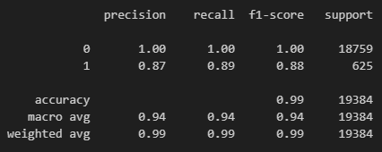

# Credit Risk Classification
module 20 repo challenge

  
---
## Table of Contents

- [Background](#background)
- [Part 1: Challenge Layout](#layout)
- [Part 2: Results/Report](#result)
- [Part 3: Conclusion](#conclusion)

---
## Background 

In this Challenge, I use various techniques to train and evaluate a model based on loan risk. I use a dataset of historical lending activity from a peer-to-peer lending services company to build a model that can identify the creditworthiness of borrowers.

---
## Part 1: Challenge Layout 

1. Split the Data into Training and Testing Sets
2. Create a Logistic Regression Model with the Original Data
3. Write a Credit Risk Analysis Report

## Part 2: Results/Report 

1. Confusion Matrix
   

2.  Classification Report
   

 

---
## Part 3: Conclusion    
How well does the logistic regression model predict both the `0` (healthy loan) and `1` (high-risk loan) labels?
 The logistical regression model predicts the heathy low risk loan with 100% percision, indicating that all positive predictions for class 0 are correct. The high risk loan is predicted with less percision at 87%, still reasonably precise in predicting class 1 instances. The accuracy of the model is 99%. The macro and weighted average metrics indicate that the model performs well across both classes, taking into account class imbalance.

